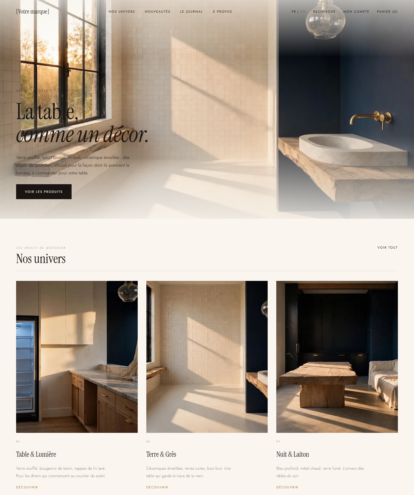
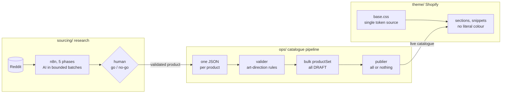
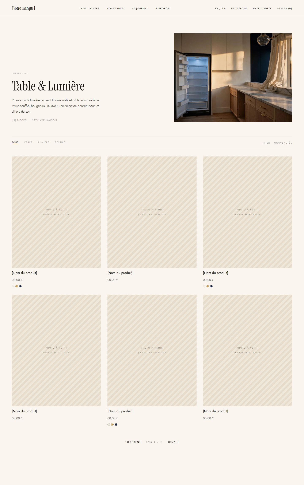
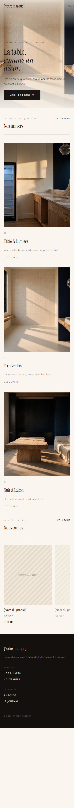
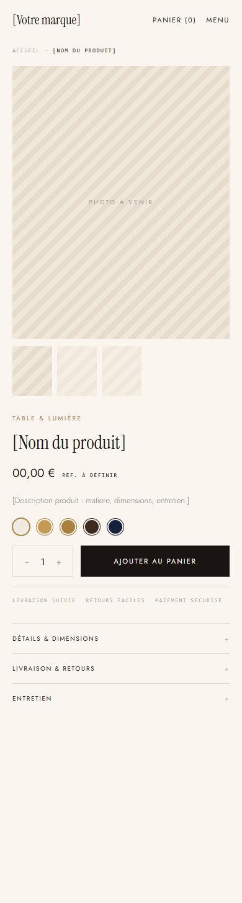
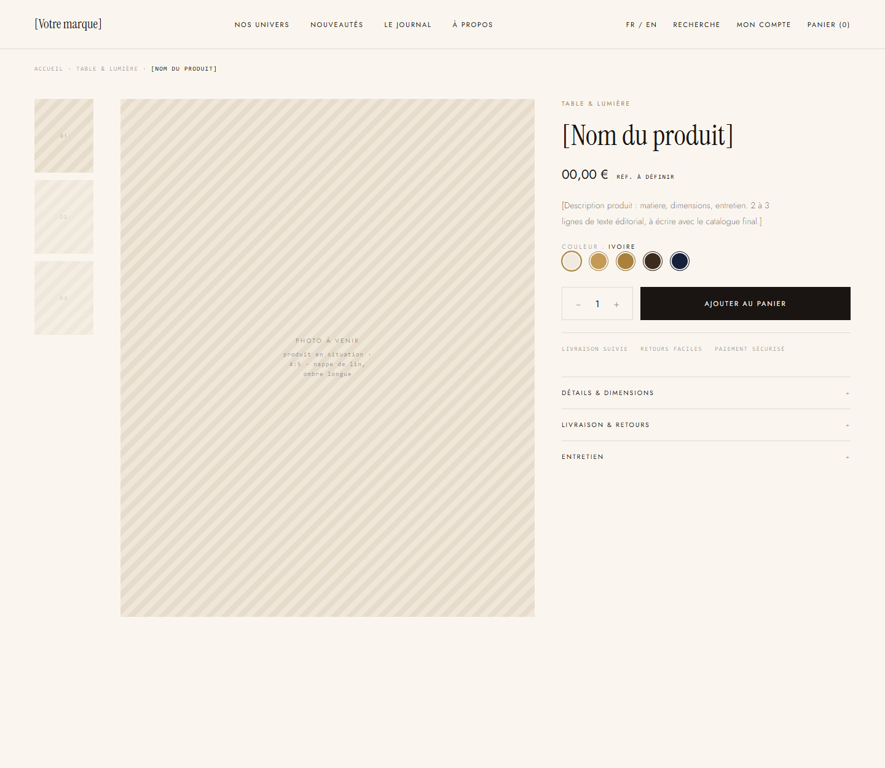

<p align="center">
  
</p>

<h1 align="center">Lumière rasante</h1>

<p align="center">
  A Shopify store built as an <strong>executable art direction</strong>, fed by a <strong>batch catalogue pipeline</strong> that refuses anything off-brand,<br>
  and by a <strong>sourcing workflow</strong> that turns Reddit complaints into validated products.
</p>

<p align="center">
  <a href="https://github.com/dreyaaaaaaaaaaaaa/E-Commerce-automating-workflow/actions/workflows/theme.yml"></a>
  <a href="https://github.com/dreyaaaaaaaaaaaaa/E-Commerce-automating-workflow/actions/workflows/catalogue-verifier.yml"></a>
  
  
  
</p>

<p align="center"><a href="#en-français">Version française plus bas</a></p>

---

## What this is

A one-person e-commerce project for tableware and home objects (France first,
then Europe), built end to end: brand direction, custom Shopify theme,
catalogue automation, CI with human checkpoints, and the research pipeline
that decides *which* products deserve a page. The interesting part is not any
single piece, it is the rule that ties them together:

> **Every design and business constraint is written as data and enforced by
> code.** A title too long for the product column, an image at the wrong
> ratio, a hard-coded colour in a section, a product batch with one missing
> translation: none of it ships. Not "ships a bit ugly". Does not ship.

That is what lets a very small team import hundreds of references without
proofreading hundreds of pages.

## Three parts, one repository



| | What it is | Why it is built this way |
|---|---|---|
| **`theme/`** | Custom Online Store 2.0 theme, ~30 files, 8 KB of dependency-free JS, FR/EN, self-hosted fonts. Home, universe (collection), product, cart drawer, predictive search, journal, full customer account, 404. | Forking Dawn meant un-learning 300 files of settings the direction does not use. Here the design *is* the theme: one token file, no `font_picker`, a CI job that fails on any literal colour in a section. |
| **`ops/`** | Node 20 pipeline, **zero npm dependency**: `valider` → `images` → `pousser` → `finaliser` → `publier`. Bulk `productSet` addressed by handle (idempotent), everything lands in DRAFT, one script flips the whole batch live or nothing. 20 unit tests, positive and negative. | A job allowed to write to a production catalogue should have nothing in its dependency tree to audit. Every script simulates by default and only writes with `--appliquer`. A half-filled collection is a broken collection. |
| **`sourcing/`** | n8n orchestration of a five-phase research loop (Reddit problem extraction → AliExpress search → AI evaluation → competition analysis → validation), the prompts, two audits with reproduced defects, runbooks. | n8n orchestrates, it never scrapes. Filtering, deduplication and maths happen in code before any AI call. A human validates before anything costs money. The two Playwright collectors are deliberately kept in a **private** repository. |
| **`docs/`** | An Obsidian vault: decision log, session journal, per-product and per-supplier tracking, one map per domain. | The repository is the project memory. `AGENTS.md` lets another engineer (or agent) resume without re-reading the code. |

## The design, in numbers

Ivory `#faf6ef`, ink `#1a1512`, brass `#a9803c`. Instrument Serif for titles,
Jost 300 for body. 1 px rules, never thicker. 320 ms motion, nothing bounces.
The product grid is strict 4:5, and when a photo is missing the placeholder
renders the brief for the shot instead of a grey box, so the site is
presentable before the photo production even starts.

<table>
  <tr>
    <td width="60%"></td>
    <td width="20%"></td>
    <td width="20%"></td>
  </tr>
  <tr>
    <td align="center"><sub>Universe page, 1440</sub></td>
    <td align="center"><sub>Home, 390</sub></td>
    <td align="center"><sub>Product, 390</sub></td>
  </tr>
</table>


<p align="center"><sub>Product page, 1440. Accordions are fed by metafields, never by the free description: the page stays uniform whoever writes the copy.</sub></p>

## Guard-rails worth reading

- **The catalogue contract** lives in [`ops/schema/regles-da.mjs`](ops/schema/regles-da.mjs): title 3 to 48 chars, no shouting caps, description 120 to 420 chars, images 4:5 ± 2 % and ≥ 1400 px, `alt` in both languages, price in cents and a multiple of 50, reference `^[A-Z]{2,4}-\d{3,5}$`, unique handle / SKU / reference. The validator never talks to Shopify: anyone can run it without a token.
- **Security is about scopes, not features.** A dedicated custom app with product / file / translation / publication scopes only; separate read and write tokens; the write token lives in a GitHub environment with mandatory review; `catalogue-lot.yml` is `workflow_dispatch` only and asks you to retype the shop domain. No `pull_request_target`, actions pinned by SHA, nothing is ever deleted automatically.
- **Honest numbers in the research loop.** The second audit found `Number(undefined)` and `Number(null)` silently validating empty AI results and mixing currencies into "low competition". Absent values now stay `null`, medians are per currency, and an insufficient sample returns `INSUFFICIENT_DATA`.
- **GDPR by construction**: consent banner on Shopify's Customer Privacy API, no third-party script in the page, fonts self-hosted so no visitor IP reaches Google, marketing opt-in that actually flips the subscriber status.

## Run it

```bash
# Theme
shopify theme dev --path theme --store <shop>.myshopify.com
shopify theme check --path theme
node tools/verifier-theme.mjs          # FR/EN key parity, snippets, sections

# Catalogue (token in ops/.env, see ops/.env.example)
cd ops
npm test                               # unit tests, no network
npm run valider                        # art-direction conformity, offline
npm run pousser                        # diff against the shop, no write
npm run lot                            # validate + images + push + finalise, up to DRAFT
npm run publier:reel                   # flip the whole batch live, or nothing
```

The sourcing workflows import into n8n from [`sourcing/n8n/`](sourcing/n8n/);
they expect the two collector APIs described in [`sourcing/README.md`](sourcing/README.md).

## Status

Theme, pipeline and CI are complete and tested. Three things are **paused on
purpose**, by decision, not oversight: final product photography, legal pages
(they need the real company details) and checkout branding. The next
concrete step is creating the three universe collections and pushing the
first real batch. Full picture in [`ARCHITECTURE.md`](ARCHITECTURE.md) § 10,
running log in [`docs/01 Journal/`](docs/01%20Journal/).

## Map

```
├── README.md  AGENTS.md  ARCHITECTURE.md    start here, then the architecture reference
├── theme/          Shopify theme            base.css tokens, media.liquid, sections, locales FR/EN
├── ops/            catalogue pipeline       schema/regles-da.mjs, src/*.mjs, tests/, data/produits/*.json
├── tools/          verifier-theme.mjs       theme coherence checks
├── .github/        three workflows          theme (check, preview, deploy), catalogue verify, catalogue batch
├── sourcing/       research pipeline        n8n/, prompts/, docs/ (audits, runbooks), config/
└── docs/           Obsidian vault           Accueil.md, journal, decisions, products, universes, maps
```

Built with Shopify Liquid, Node 20, GitHub Actions, n8n, Playwright (private),
Claude Code and Claude Design for the visual comps. French in code and comments;
technical identifiers imposed by Shopify stay in English.

---

<a id="en-français"></a>
## En français

**Lumière rasante** est une boutique Shopify d'art de la table et de
décoration (France, puis Europe), construite de bout en bout : direction
artistique, thème custom, automatisation du catalogue, CI avec points de
contrôle humains, et le pipeline de recherche qui décide quels produits
méritent une page.

Le principe qui relie tout : **chaque contrainte de design ou de métier est
écrite en données et vérifiée par du code.** Un titre trop long pour la
colonne produit, une image au mauvais ratio, une couleur en dur dans une
section, un lot avec une traduction manquante : rien de tout cela n'est
publié. C'est ce qui permet d'importer des centaines de références sans en
relire des centaines.

Trois parties dans un seul dépôt :

- **`theme/`** : thème Online Store 2.0 custom, ~30 fichiers, 8 Ko de JS sans dépendance, FR/EN, polices auto-hébergées. Un seul fichier de tokens, pas de `font_picker`, la CI refuse toute couleur littérale.
- **`ops/`** : pipeline catalogue Node 20 **sans dépendance npm**, cinq étapes rejouables, tout arrive en DRAFT, un script bascule le lot entier ou rien. Vingt tests unitaires.
- **`sourcing/`** : cinq workflows n8n (extraction des problèmes sur Reddit, recherche AliExpress, évaluation IA, analyse de la concurrence, validation), les prompts, deux audits, les guides. Les collecteurs Playwright restent dans un dépôt **privé**, volontairement.
- **`docs/`** : coffre Obsidian, la mémoire du projet (journal, décisions, suivi produit).

Pour reprendre le travail : lire [`AGENTS.md`](AGENTS.md), puis
[`ARCHITECTURE.md`](ARCHITECTURE.md). Trois zones sont en pause sur décision
(photos finales, pages légales, habillage du checkout) ; prochaine étape
concrète : créer les trois collections univers et pousser le premier lot.
