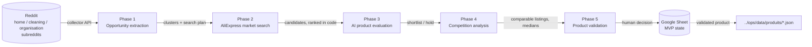

# Sourcing pipeline: from Reddit complaints to a validated product

This folder is the research half of the project: how a product gets *chosen*
before it ever reaches the Shopify catalogue in `../ops/`. It is an
orchestration layer (n8n) around two small local collectors, with AI used
late, in bounded batches, and a human gate before anything costs money.

> **What is published here and what is not.** The n8n workflows, the prompts,
> the audits and the runbooks are public. The two Python collectors (a Reddit
> reader and an AliExpress product-page collector, both Playwright, visible
> browser, public pages only, no login, no CAPTCHA bypass, no proxies) are kept
> in a private repository on purpose. The workflows call them over a local
> HTTP API (`127.0.0.1:8787` and `:8789`), so everything here reads without
> them, it just does not run without them.

## The five phases

| Phase | Workflow | What it does | Where the AI is |
|---|---|---|---|
| 1 | `n8n/Dropship phase 1 v2 Reddit.json` | reads pre-filtered posts from the discovery API, extracts concrete problems people describe | `prompts/n8n/01-opportunity-extractor.md`, then `02-cluster-and-search-plan.md` |
| 2 | `n8n/Dropship phase 2 v2 AliExpress.json` | turns each cluster into search queries, collects candidate listings, ranks them **deterministically** (price band, orders, rating, query overlap) | none |
| 3 | `n8n/Dropship phase 3 v2 AI Evaluation.json` | scores a bounded batch of candidates against the problem they are supposed to solve | `03-product-evaluator.md` |
| 4 | `n8n/Dropship phase 4 v2 Competition Analysis.json` | searches comparable listings, classifies them (direct / adjacent / noise), computes medians per currency | `04-competition-comparability.md` |
| 5 | `n8n/Dropship phase 5 v1 Product Validation.json` | exact SKU, delivered cost to France, freight quote, plug compatibility; ends in a **human** go / no-go | none |
| all | `n8n/Dropship end-to-end orchestrator v1.json` | runs the phases in order, manually triggered, never scheduled | |

## Principles (the ones that survived the audits)

1. **n8n orchestrates, it does not scrape.** Collection lives in code, with raw pages archived so a parser can be fixed offline.
2. **Filter, deduplicate and compute in code before any AI call.** Batches are bounded and every call logs its token usage.
3. **Numbers stay honest.** `Number(undefined)` is `NaN`, `Number(null)` is `0`: both were found silently validating empty results. Absent values now stay `null`, per-currency, and an insufficient sample returns `INSUFFICIENT_DATA` rather than "low competition".
4. **A human validates before anything expensive**: supplier sampling, ordering, ads, listing.
5. **Nothing is deleted automatically.** Ever.
6. Public pages only, low volume, internal use. The local APIs have no authentication and must never be exposed.

## Reading order

| Document | Why |
|---|---|
| `docs/project-state-and-implementation-plan.md` | the reference: real state of the collectors and workflows, target MVP architecture, implementation order (2026-09-02) |
| `docs/audit-2026-09-05.md` | the second audit: eight reproduced n8n defects with their fix, plus the economics of a first product under a 100 to 150 € budget |
| `docs/technical-corrections-2026-09-05.md`, `-lot2.md` | what was actually corrected after the audit, in two batches |
| `docs/n8n-runbook.md` | how to start the two APIs, import the workflows, and what each phase writes |
| `docs/n8n-integration-blueprint.md` | request bodies, state machine, retry rules |
| `docs/qwen-opportunity-gate-benchmark.md` | can a small local model (Qwen) replace the hosted one for the phase 1 gate? Measured, not assumed |
| `docs/*.cjs` | non-regression scripts for the n8n node logic: `node docs/audit-2026-09-05-regression.cjs`, no network, no writes |

## Configuration

- `config/n8n-runtime.env.example`: the two API base URLs, set once in n8n *Settings > Variables*.
- `config/problem_discovery.json`: the subreddit categories, limits and deterministic filters used by the discovery collector.
- The workflows reference a Google Sheet as `VOTRE_ID_GOOGLE_SHEET`: replace it with your own after import.

## Where this connects to the shop

A product that passes phase 5 becomes one JSON file in `../ops/data/produits/`,
which must then pass the art-direction validator (`npm run valider`) before
the catalogue pipeline pushes it as a draft. The two halves share one rule:
**the file is the source of truth, the tool only writes with `--appliquer`.**

---

## En français, en bref

Ce dossier est la moitié « recherche » du projet : comment un produit est
choisi avant d'entrer dans le catalogue Shopify. Cinq workflows n8n
(extraction des problèmes sur Reddit, recherche AliExpress, évaluation IA,
analyse de la concurrence, validation finale) orchestrent deux collecteurs
Python locaux. Les workflows, les prompts, les audits et les guides sont
publiés ; **le code des collecteurs est volontairement conservé dans un dépôt
privé** (collecte de pages publiques uniquement, sans connexion, sans
contournement de CAPTCHA, sans proxy). Principes : n8n orchestre et ne scrape
pas, on filtre et on calcule en code avant l'IA, un humain valide avant toute
dépense, aucune suppression automatique. Commencer par
`docs/project-state-and-implementation-plan.md`, puis `docs/audit-2026-09-05.md`.
