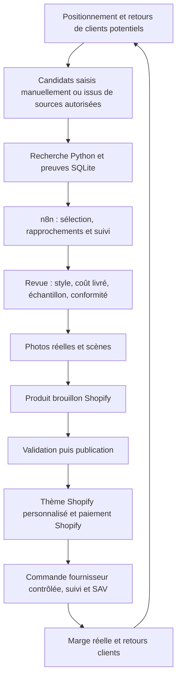

# Audit du projet : Shopify, sourcing et rentabilité

Date : 5 septembre 2026. Contraintes confirmées : **100–150 € de budget total**, France en premier, Europe envisagée ensuite, Shopify choisi, direction artistique personnalisée avec objets mis en situation.

## Avis et décision proposée

**La base technique est utile pour la recherche, mais la viabilité commerciale reste à démontrer.** Aucun chiffre de ventes, de conversion, de coût d'acquisition ou de coût fournisseur réellement livré ne permet de qualifier le projet de rentable aujourd'hui. Les scores IA ne remplacent pas ces données.

Avec ce budget, viser une validation progressive : **une ambiance, un produit principal, éventuellement un complément, un échantillon réel et du contenu organique**, puis une petite boutique Shopify. Un lancement publicitaire paneuropéen ou une boutique comportant beaucoup de références dépasserait les moyens disponibles. Même une validation minimaliste peut consommer le budget sans générer de ventes.

Le meilleur angle à tester serait une petite marque d'objets pour la maison, choisis pour leur style et leur utilité, présentés dans un univers cohérent. Ce positionnement est une recommandation, pas une demande de marché déjà constatée. L'idée « pièce → table → mug » se prête bien à une section Shopify sur mesure.

## Périmètre et vérifications

Inspection du dépôt local : documentation, configuration, modèles de données, stockage, APIs, services de collecte, logique de filtrage, prompts, six exports n8n et tests. Lecture des deux bases principales en mode SQLite `mode=ro`. Vérification de sources officielles pour Shopify, importations et obligations directement liées au projet.

- **28 tests Python réussis**, avec `python -m unittest discover -s tests -v`.
- **8 défauts reproduits** en exécutant le code réel des nœuds exportés sur des données synthétiques : `node docs/audit-2026-09-05-checks.cjs`.
- Reproduction séparée en base temporaire du mélange de destinations dans le catalogue AliExpress.
- Aucun scraping live, aucun appel IA payant, aucune modification de Sheets ou de Shopify. Les workflows importés dans une instance n8n peuvent différer des exports locaux ; leur exécution réelle n'a pas été vérifiée.
- Les reproductions JavaScript simulent les entrées des nœuds, pas tout le moteur n8n ni son mécanisme de liaison des items. Elles constatent des défauts, elles ne les corrigent pas.

### État mesuré

| Élément | Constat local |
|---|---:|
| Posts Reddit stockés | 1 083 |
| READY_FOR_AI / FILTERED / AI_REJECTED | 622 / 457 / 4 |
| Exécutions Reddit / erreurs enregistrées | 23 / 100 |
| Produits / fournisseurs / variantes AliExpress | 27 / 27 / 86 |
| Captures détaillées | 42 : 29 ok, 13 partial |
| Recherches AliExpress | 13 : 9 ok, 4 partial |
| Fiches normalisées FR/EUR avec prix éligible | 19 |
| Appels IA journalisés | 47, tous avec tokens estimés |
| Total estimé des tokens journalisés | 95 278 |
| Appels avec coût USD renseigné | 0 sur 47 |
| Exports n8n | 6, tous inactifs et manuels |
| Boutique, thème Shopify, intégration de commandes | Absents du dépôt |

Les erreurs sont des enregistrements cumulés, pas 100 exécutions en échec. Les données locales ne constituent ni le relevé complet du fournisseur IA, ni une lecture du Google Sheet. L'absence de `AI_ACCEPTED` dans SQLite ne prouve donc pas l'absence de décisions acceptées dans Sheets : le workflow MEGA TEST écrit ses décisions dans Sheets sans confirmer les statuts source en base.

## Architecture : conserver les fondations, réduire le périmètre

Les choix solides : séparation `problem_discovery` / `aliexpress_collector`, n8n pour orchestrer, preuves brutes archivées, historique SQLite, déduplication des sources, variantes et fournisseurs distincts, calculs déterministes avant IA, sorties partielles explicites, profils navigateur dédiés. SQLite et deux petites APIs locales sont proportionnés à un MVP manuel ; une migration vers des microservices n'apporterait pas de valeur à ce stade.

Architecture conseillée :



La boutique doit fonctionner même si le PC, les collecteurs ou n8n sont arrêtés. Aucun appel à `localhost:8787/8788/8789` depuis le navigateur des clients. Shopify porte le catalogue vendu, les commandes et les stocks commerciaux ; SQLite conserve la recherche et les preuves. Sheets peut rester l'interface de revue tant que les identifiants sont stables.

Pour le premier produit, création manuelle dans Shopify et contrôle manuel des commandes sont raisonnables. Une synchronisation Admin API vers des **brouillons**, puis une intégration fournisseur avec contrôle des variantes, pourra venir après validation commerciale. Le scraper actuel n'est pas un connecteur de commande ou de fulfillment.

## Défauts et améliorations techniques prioritaires

P1 : corriger avant de se fier à une chaîne automatisée. P2 : corriger avant répétition régulière ou extension à plusieurs marchés. Les constats citent le fichier et le nom exact du nœud pour rester retrouvables dans les exports.

| Priorité | Constat et preuve | Conséquence | Correction proposée |
|---|---|---|---|
| P1 : A01 | `Dropship phase 1 v2 Reddit.json`, `Append accepted opportunity`, écrit `NEW`. `Dropship phase 2 v2 AliExpress.json`, `Select all pending accepted opportunities`, accepte MEGA_TEST_ACCEPT, PHASE1_ACCEPTED, PHASE2_RETRY, PHASE2_NO_MATCH, mais pas NEW. Reproduit. | Le chemin v2 recommandé par le runbook s'arrête entre les phases 1 et 2. | Un contrat de statuts unique, un workflow canonique et un test de passage phase 1 → phase 2. |
| P1 : A03 | Phase 3, `Validate every Phase 3 result` : `Number(undefined)` vaut NaN et les comparaisons `< seuil` sont fausses. Une réponse `shortlist` sans aucun score passe. Reproduit. | Une sélection paraît validée alors que ses critères sont absents. | Schéma strict : champs requis, types, nombres finis, bornes, identifiants uniques et couverture exacte ; sortie invalide → retry. Vérifier aussi les contraintes métier indépendamment des scores. |
| P1 : A05/A07 | Phase 4, `Calculate measured competition` : `Number(null)` devient 0 ; en l'absence de prix de la devise cible, le fallback mélange les autres devises. Reproduit avec USD/PLN étiquetés EUR. | Médianes et disponibilité des données de commandes erronées. | Garder les absences à null, valider avant conversion, calculer par devise ; aucune conversion implicite. Ajouter un taux sourcé/daté seulement si nécessaire. |
| P1 : A06 | Même nœud : 15 classifications `direct` avec confiance 10 donnent `LOW`, car la couverture compte les classifications faibles mais `directCount` les exclut. Reproduit. | L'incertitude est présentée comme peu de concurrence. | Calculer une couverture exploitable et retourner INSUFFICIENT_DATA si elle est insuffisante. |
| P1 : A08 | Phase 1 v2, `Validate AI JSON`, lit seulement `$input.first()`. Deux réponses de lots injectées donnent une seule sortie. Le journal d'usage utilise aussi `first()`. | Les lots suivants peuvent être ignorés ; l'association n8n `.item` doit aussi être vérifiée en exécution réelle. | Itérer sur les lots, associer par `batch_id`, vérifier un résultat par source et journaliser chaque appel. |
| P1 | Phase 3, `Write HOLD and SHORTLIST links with every decision`, fait l'upsert sur le titre + product_id, sans identifiant d'opportunité. La phase 2 distingue pourtant opportunité + lien. | Un même produit évalué pour deux besoins peut perdre une décision ; la phase 4 retient aussi la première correspondance par product_id. | Clé d'évaluation composée de `opportunity_id`, `product_id`, `destination_country`, `prompt_version` ; titre réservé à l'affichage. |
| P2 : A04 | Phase 3 marque les formats invalides PHASE3_RETRY mais son entrée ne lit que RESEARCHED. Reproduit. | La relance manuelle du workflow ne reprend pas ces erreurs. | Inclure explicitement les retries éligibles, avec nombre de tentatives et prochaine date. |
| P2 : A02 | Phase 2, `Rank candidates deterministically`, calcule `query_overlap` mais ne filtre que product_id et titre. Un pneu est conservé pour « ceramic mug ». Reproduit. | Des détails coûteux sont collectés pour des résultats sans pertinence ; le runbook affirme à tort que le recouvrement est obligatoire. | Filtre de pertinence minimal et limite de 2–3 candidats à ce budget ; prévoir les synonymes et langues au lieu d'un seul test lexical rigide. |
| P2 | Phase 2 conserve seulement le nombre de `remaining_product_ids` dans sa préparation de statut. L'entrée suivante relance la recherche entière. PHASE2_NO_MATCH est aussi repris sans délai. | Upsert évite certaines lignes dupliquées mais pas les collectes répétées. | Persister les IDs restant à traiter, le run et les essais ; reprendre cette liste ; plafonner les opportunités par exécution. |
| P2 | Phase 1 v2 utilise append sans clé stable ; le mapping Sheets ne contient pas source_id/source_url, alors que le nœud suivant attend `$json.source_id`. | Pas d'idempotence après une interruption ; risque de perte de provenance et de confirmation source, à tester avec la sortie réelle du nœud Sheets. | Upsert sur un ID stable, persister les sources, confirmer via le contexte original après écriture réussie. |
| P2 | `src/aliexpress_collector/storage.py` : products est indexé par product_id seul et `_latest_snapshot` ignore le pays. Reproduction FR/EUR → PL/PLN : une seule fiche actuelle PL et des changements de prix/devise. | La deuxième destination écrase la vue de la première ; les différences de pays ressemblent à des variations temporelles. | Séparer identité produit et offre `(product_id, sku_id, country, currency)` ; comparaison des snapshots par marché. L'historique brut existe encore. |
| P2 | Les upserts conservent volontairement certains anciens champs lors d'une capture partial tout en actualisant la date globale. | Une lecture du « dernier produit » peut contenir des faits d'âges différents, sans preuve de fraîcheur par champ. | Évaluer un snapshot identifié et conserver la date de preuve de chaque métrique réutilisée ; distinguer absent, ancien et zéro. |
| P2 | URLs mélangées entre 127.0.0.1:8788 et host.docker.internal:8789 ; le runbook lance 8788 puis exige 8789 en phases 3/4. | Configuration non reproductible avec les seules instructions documentées. | Deux URLs de base configurées au même endroit, commandes correspondantes et health checks depuis le runtime n8n. La simple substitution Docker n'est pas une preuve de joignabilité du service lié à loopback. |
| P2 | APIs HTTPServer synchrones, profils navigateur persistants, pas de réservation durable de travail ni verrou partagé entre processus. | Longues requêtes bloquantes, risque de double traitement si CLI et n8n sont lancés ensemble. | Un seul lancement manuel à la fois immédiatement ; jobs persistants et verrou/lease seulement quand la cadence le justifie. |

### Fiabilité et exploitation complémentaires

- La documentation du 2 septembre est un historique, pas une description actuelle : elle annonce 20 tests, pas d'API Reddit et d'anciens workflows. Le runbook est lui aussi partiellement décalé. Ajouter une page « état actuel » et la configuration exacte, garder l'audit historique.
- Les prompts Markdown ne sont pas automatiquement la source des prompts intégrés dans les exports. Par exemple, le gate « strict » des tests et le prompt d'opportunité v2 ne portent pas exactement la même politique. Versionner et synchroniser ces contrats.
- Les 47 appels journalisés ont `estimated_cost_usd = null`. Mesurer modèle exact, usage fournisseur, prix applicables et budget cumulé ; compter les erreurs aussi. Un comptage caractères/4 n'est pas une facture, notamment s'il omet le prompt système.
- Le pré-score autorise potentiellement un post récent et long sans signal de problème : récence + longueur peuvent atteindre le seuil 35. C'est un filtre de volume, pas une mesure de demande solvable. Le benchmark humain proposé est utile, mais son résultat n'est pas fourni dans le dépôt. Garder aussi un petit jeu de validation distinct des exemples utilisés pour régler le prompt.
- Les 28 tests couvrent surtout Python et les fixtures ; ils n'attestent pas le fonctionnement de bout en bout de n8n, Sheets ou Shopify. Ajouter d'abord les contrats correspondant aux défauts reproduits, un test de reprise, puis un petit cycle manuel avec preuve des écritures.
- `data/` est ignoré par Git : prévoir une sauvegarde SQLite cohérente avec WAL et une restauration testée. Un dépôt Git ne sauvegarde donc pas les données actuelles. Les sources sont encore non suivies dans l'état observé ; aucun commit n'a été créé lors de cet audit.
- Dépendance Playwright non verrouillée ; environnement exécuté : Python 3.8.8. Préparer un environnement Python maintenu et des versions reproductibles, sans interrompre le prototype fonctionnel avant vérification de compatibilité.
- Les APIs restent locales sans authentification, conformément au prototype. Ne pas les rendre publiques pour connecter Shopify. Un futur worker distant devra avoir une authentification et un transport appropriés.
- L'ancien audit signale des secrets exposés. Le contrôle heuristique des paramètres des exports actuels n'a pas retrouvé les motifs de secrets recherchés ; cela ne prouve ni leur révocation ni l'absence de toute fuite historique. Vérifier la rotation côté fournisseurs avant réutilisation.

## Le décalage commercial à résoudre

Le moteur actuel cherche un problème explicite, une contrainte non satisfaite et une solution fonctionnelle. Il peut refuser les objets ordinaires sans avantage fonctionnel. Or un mug, un vase ou un textile peut être acheté pour sa forme, sa couleur, un cadeau ou son association à un intérieur.

Créer deux voies de candidature vers le même sourcing :

1. **Utilité** : preuve d'un besoin, adéquation fonctionnelle, contraintes mesurables.
2. **Style** : cohérence avec l'ambiance, qualité réelle, valeur perçue à un prix affiché, retours de clients potentiels, facilité à photographier et à associer.

Ne pas demander à un modèle de texte de certifier la qualité visuelle. Le score de style doit venir d'une revue des visuels et de l'échantillon. Les critères communs restent coût livré, risque de casse/retour, disponibilité et conformité.

Au lancement, limiter les catégories au foyer et à l'ambiance choisie. Les communautés voiture, animaux, famille, bricolage ou voyage multiplient les directions sans servir forcément la marque. Le marché français doit être interrogé directement : des discussions anglophones sur Reddit ne démontrent pas une demande française.

La phase 4 mesure au mieux **la saturation d'un échantillon de résultats AliExpress**. Elle ne mesure ni la concurrence française totale, ni le coût publicitaire, ni les ventes. Renommer la donnée pour rendre cette portée visible. Pour chaque finaliste, relever manuellement 5–10 offres concurrentes accessibles aux Français : prix livré, délai, retours, caractéristiques réellement comparables, photos et promesse. Conserver URL et date. Une offre peu présente sur AliExpress peut simplement être peu recherchée.

Concernant la source Reddit, la politique actuelle demande une autorisation écrite explicite pour l'utilisation commerciale des données. Ne pas fonder toute la capacité de recherche sur la pérennité de ce canal ; la saisie manuelle de candidats et les retours directement recueillis auprès de clients doivent être possibles. [Politique officielle Reddit](https://support.reddithelp.com/hc/en-us/articles/42728983564564-Responsible-Builder-Policy).

## Shopify et la direction artistique en situation

**Un thème Shopify gratuit personnalisé est adapté.** Une vitrine séparée en React/headless ajouterait de la maintenance alors que les sections Liquid, templates JSON, metafields et metaobjects permettent déjà de construire l'expérience proposée. [Architecture officielle des thèmes](https://shopify.dev/docs/storefronts/themes/architecture), [metaobjects Shopify](https://help.shopify.com/en/manual/custom-data/metaobjects).

### Premier parcours concret

Une photo de pièce avec une table et le produit réellement vendu. Un bouton « Découvrir le mug » et un repère cliquable sur le mug ouvrent sa fiche ou un panneau avec photo, prix et variantes. La fiche présente d'abord l'objet dans cette ambiance, puis un détail de matière, une vue de l'échelle et une photo simple. L'achat reste direct ; aucun zoom animé ou passage obligatoire par une pièce virtuelle.

Sur mobile, utiliser une composition verticale dédiée et une fiche produit accessible aussi sous l'image. Les repères doivent être de vrais boutons utilisables au toucher et au clavier. La variante sélectionnée doit correspondre à celle photographiée ; si elle est épuisée, afficher son état réel. Préciser ce qui est inclus : acheter le mug n'inclut ni la table ni les autres accessoires.

### Modèle de contenu minimal

| Objet | Champs utiles |
|---|---|
| Ambiance | Nom, image desktop, image mobile, texte court, produits associés |
| Repère | Référence produit/variante, position x/y desktop et mobile, libellé accessible |
| Produit | SKU vendu, dimensions, matière vérifiée, entretien, prix et variante Shopify |
| Preuve fournisseur privée | SKU fournisseur exact, destination, date, coût livré, délai testé, documents et résultat d'échantillon |
| Média | Produit/variante représenté, droits d'utilisation, photo réelle ou composition, validation de fidélité |

Commencer avec **une seule section de scène** configurée dans l'éditeur, et une fiche produit adaptée. Les metaobjects deviennent intéressants quand plusieurs ambiances réutilisent le même contenu ; inutile d'en faire une plateforme complexe dès le premier produit.

### Production des visuels

- Commander un échantillon exact et le photographier dans une pièce disponible, au téléphone et en lumière naturelle. Un cadrage serré, une palette cohérente et quelques accessoires déjà possédés suffisent pour le premier test.
- Produire une scène principale, une vue simple, deux détails et une courte vidéo d'usage. Réutiliser la même séance pour les réseaux sociaux.
- Les décors générés ou les compositions peuvent compléter les photos, mais il faut préserver forme, dimensions, couleur, finition et usage réel du produit. Ne pas inventer une matière premium, une fabrication artisanale ou une caractéristique invisible dans les preuves. Une photo fidèle reste nécessaire pour que le client sache ce qu'il achète.
- Optimiser les images, charger les scènes secondaires à la demande et limiter les scripts. Une direction artistique forte ne justifie pas une boutique lente ; Shopify documente ces pratiques. [Performance des thèmes](https://shopify.dev/docs/storefronts/themes/best-practices/performance).

L'avantage à construire combine sélection, présentation, fiabilité et expérience après achat. De belles images seules ne garantissent pas que les clients accepteront un prix supérieur.

## Rentabilité : le calcul qui manque

Calculer la contribution par commande, puis le résultat mensuel. Les sommes sont illustratives ; aucun produit actuellement stocké n'est déclaré rentable sur leur base.

```text
Revenu net = vente encaissée − TVA collectée applicable − remises
Coût variable = achat exact + livraison + emballage + droits/taxes non récupérables
                + frais de paiement + provision retours/casse/litiges
Contribution avant acquisition = revenu net − coût variable
Contribution après acquisition = contribution avant acquisition − coût d'acquisition
Résultat mensuel = somme des contributions − frais fixes − autres charges de l'activité
```

Le coût doit porter sur le SKU vendu et la livraison vers la France, sans dépendre d'un coupon de nouveau client. `eligible_min_price` n'est pas un prix livré : `_apply_destination_eligibility` vérifie essentiellement disponibilité/stock connu et compatibilité de prise. Il ne prouve pas l'expédition, les droits, les délais, la conformité ou la qualité.

Le taux normal français de TVA est 20 %. Le scénario suivant suppose son application à la vente et des coûts calculés après traitement cohérent de la TVA récupérable. Le pays d'établissement et le régime du vendeur ne sont pas connus : une franchise de TVA ou une implantation hors France change le calcul. Les taxes non récupérables doivent rester dans les coûts. [Taux de TVA, Douane française](https://www.douane.gouv.fr/fiche/les-taux-de-tva).

### Deux scénarios pédagogiques

Livraison offerte au client ; frais de paiement **hypothétiques et prudents de 3 % + 0,30 €**, pas un devis Shopify. Coûts fournisseur, livraison et provisions entièrement hypothétiques.

| Par commande | Petit objet à 24,90 € | Offre à 39,90 € |
|---|---:|---:|
| Prix TTC | 24,90 € | 39,90 € |
| Revenu hors TVA à 20 % | 20,75 € | 33,25 € |
| Achat exact | −7,00 € | −9,00 € |
| Livraison/emballage | −4,00 € | −4,00 € |
| Droit d'importation supposé, non déjà inclus | −3,00 € | −3,00 € |
| Frais de paiement simulés | −1,05 € | −1,50 € |
| Provision retours/casse | −1,50 € | −2,00 € |
| **Contribution avant acquisition** | **4,20 €** | **13,75 €** |
| Acquisition payante simulée à 8 € | −8,00 € | −8,00 € |
| **Contribution après acquisition** | **−3,80 €** | **5,75 €** |

À 36 € de frais fixes mensuels seuls, il faudrait environ 9 commandes organiques du premier scénario ou 3 du second pour couvrir ce seul abonnement. Avec 8 € d'acquisition, le premier perd de l'argent à chaque vente ; le second nécessiterait environ 7 ventes pour couvrir ces 36 €. Ces seuils excluent cotisations, impôts sur le résultat, rémunération des deux porteurs, échantillons et autres coûts fixes. Ce ne sont pas des bénéfices nets.

À titre de sensibilité, un clic coûtant 0,30 € avec 1 % de conversion donne 30 € d'acquisition par achat ; à 3 %, il donne 10 €. Ce sont des hypothèses arithmétiques, pas des performances publicitaires attendues. Le contenu organique évite l'achat de trafic mais consomme du temps : l'enregistrer même si vous ne vous payez pas au début.

Augmenter le prix ou vendre un lot n'améliore le résultat que si des clients acceptent réellement l'offre. Un lot expédié par plusieurs fournisseurs peut cumuler livraison, droits et SAV. Préférer si possible un ensemble expédiable en un colis, après devis et test réel.

### Importations : changement déjà applicable en septembre 2026

Depuis le 1er juillet 2026, un droit transitoire de **3 € par catégorie tarifaire distincte** s'applique aux petits colis de moins de 150 € concernés, envoyés directement à des consommateurs dans l'UE. Ce n'est pas automatiquement 3 € pour tout le panier, ni 3 € par exemplaire identique. Vérifier le flux et ce qui est déjà payé dans le devis, sans compter deux fois le droit. Le Conseil distingue ce dispositif d'éventuels frais de traitement. [Conseil de l'UE, texte et calendrier](https://www.consilium.europa.eu/en/press/press-releases/2026/02/11/council-gives-final-green-light-to-new-customs-duty-rules-for-small-parcels/).

Comparer un fournisseur expédiant d'un stock UE déjà dédouané peut donc être utile, même avec un prix produit plus élevé. La seule mention « entrepôt UE » n'est pas une preuve du coût final, du statut douanier ou du délai.

## Budget concret : 100–150 €

La page française Shopify consultée affiche Basic à **36 €/mois en paiement mensuel**, ou 27 €/mois avec paiement annuel, et une offre d'entrée à 1 €/mois pendant trois mois après l'essai. Vérifier l'éligibilité, les taxes et la facturation au moment de souscrire. L'équivalent mensuel d'un paiement annuel ne doit pas être confondu avec un engagement mensuel ; ne pas engager une année avec ce budget. [Tarifs Shopify France](https://www.shopify.com/fr/tarifs).

| Affectation indicative | Budget 100 € | Budget 150 € |
|---|---:|---:|
| Échantillon(s), livraison comprise : plafond | 50 € | 50 € |
| Enveloppe premier mois Shopify, hors éventuel supplément fiscal | 36 € | 36 € |
| Domaine : enveloppe, achat différable | 0 € | 15 € |
| Réserve pour commandes/SAV/imprévus | 14 € | 49 € |
| Thème, applications payantes, publicité | 0 € | 0 € |
| **Total affecté** | **100 €** | **150 €** |

Ces enveloppes ne sont pas des devis et n'incluent pas d'éventuels frais de formalisation de l'activité, de conformité, d'assurance, de génération d'images ou les abonnements existants. Toute dépense supplémentaire doit réduire un autre poste ou décaler l'ouverture. Avec 100 €, je privilégierais **l'échantillon et le test de contenu avant de démarrer l'abonnement** : 14 € de trésorerie résiduelle ne suffisent pas à absorber confortablement commandes et remboursements.

Si l'offre d'entrée Shopify est applicable, garder l'économie en réserve et prévoir le passage au tarif normal. Préparer les photos et la fiche avant de démarrer la période payante. Aucun achat de thème ou d'application de repères cliquables n'est nécessaire pour la section proposée.

Les paiements clients ne sont pas immédiatement disponibles sur le compte bancaire. Le fournisseur peut devoir être payé avant le versement Shopify ; garder une limite de commandes compatible avec le fonds de roulement. Exemple : trois commandes à 14 € de coût livré mobilisent 42 € avant remboursement éventuel. La réserve de 49 € devient déjà étroite. [Délais de versement Shopify Payments France](https://help.shopify.com/fr/manual/payments/shopify-payments/supported-countries/france/payouts).

## Le cas du mug et la qualité de service

Le mug est un bon exemple visuel, mais pas automatiquement le meilleur premier produit : prix souvent faible, casse possible, coût d'expédition et contact alimentaire. Les matériaux au contact des aliments sont soumis à des exigences européennes, avec des règles spécifiques notamment pour la céramique. Une photo ou une affirmation du vendeur AliExpress ne suffit pas à vérifier cela. Si les documents et essais nécessaires ne sont pas disponibles dans le budget, choisir un objet plus simple à vérifier. [Commission européenne, matériaux au contact des aliments](https://food.ec.europa.eu/food-safety/chemical-safety/food-contact-materials_en).

Le vendeur reste responsable de la bonne exécution, de la qualité et de la livraison même si un fournisseur expédie. Préparer identité du vendeur, prix total, délais réalistes, retours, garanties et coordonnées de contact avant ouverture. [DGCCRF, dropshipping](https://www.economie.gouv.fr/dgccrf/les-fiches-pratiques/dropshipping-comment-respecter-la-reglementation). La vente à distance dans l'UE prévoit généralement 14 jours de rétractation et une garantie légale minimale de deux ans, avec exceptions et modalités à appliquer au produit. [Your Europe, garanties et retours](https://europa.eu/youreurope/business/selling-in-eu/consumer-contracts-guarantees/consumer-guarantees/index_en.htm).

Vérifier les obligations de sécurité et de traçabilité du produit, notamment les informations du fabricant et de la personne responsable dans l'UE lorsqu'elles sont requises. [Your Europe, vente à distance et sécurité](https://europa.eu/youreurope/business/selling-in-eu/selling-goods-services/ecommerce-distance-selling/index_en.htm). La forme de l'activité, son pays d'établissement et les éventuelles obligations par catégorie ou emballage restent à préciser avant vente ; cet audit n'est pas une validation de ces éléments.

## Plan d'action proportionné

1. **Cadrage gratuit.** Choisir une clientèle et une ambiance ; comparer trois candidats maximum à prix livré ; documenter 5–10 offres françaises comparables. Saisir directement les candidats si le pipeline ne les accepte pas encore. Garder la France comme seul marché de lancement.
2. **Fiabilité minimale.** Aligner statuts et URLs, fermer les défauts de validation IA, conserver les identifiants source/opportunité/produit. Mettre la phase 4 de côté jusqu'à correction ; son score n'est pas nécessaire pour tester une offre.
3. **Échantillon et coût.** Vérifier la variante exacte, la matière, l'emballage, le délai et les documents applicables. Faire la fiche de contribution. Refuser un produit dont les coûts ou exigences essentielles restent inconnus.
4. **Contenu avant abonnement.** Photographier une ambiance et produire plusieurs contenus courts avec le prix envisagé. Recueillir des retours explicites sur l'objet et le prix. Vues et likes seuls ne valident pas l'offre ; ne pas prendre de commandes impossibles à honorer.
5. **Boutique minimale.** Personnaliser un thème gratuit : scène avec repère, fiche claire, panier, livraison et retours. Tester le parcours mobile, la variante, le prix, le paiement et le suivi avant publication. Pas d'extension Europe tant que coût livré et service ne sont pas vérifiés dans chaque pays.
6. **Mesure réelle.** Suivre visites qualifiées, clics produit, ajouts au panier, commandes, coût livré réel, marge après remboursements, délais et temps de travail. Les premières commandes prouvent une possibilité de vente ; attendre une observation des livraisons/retours avant de conclure à une rentabilité durable.

Garde-fou budgétaire : ne pas augmenter les dépenses si la contribution est négative, si le coût d'approvisionnement n'est pas confirmé, si l'échantillon déçoit ou si la réserve ne couvre pas les commandes en attente. L'étape suivante doit répondre à une incertitude commerciale précise, pas seulement ajouter une automatisation.

**Prochaine réalisation recommandée : une fiche d'offre complète pour un seul produit et une scène réelle, avec coût livré vérifié.** C'est ce qui permettra de décider utilement s'il faut investir davantage dans la boutique.
